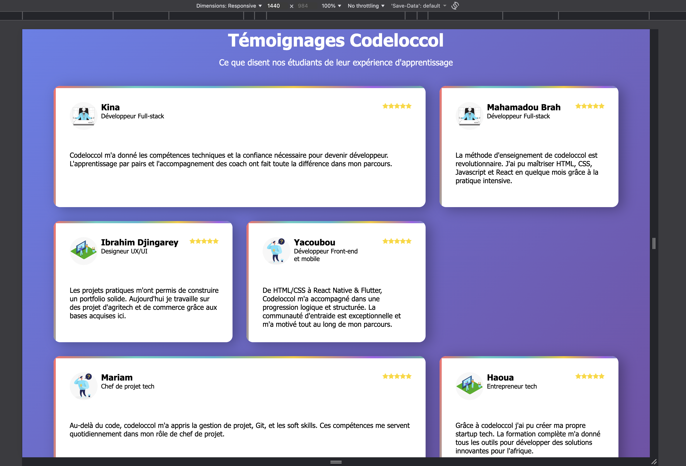
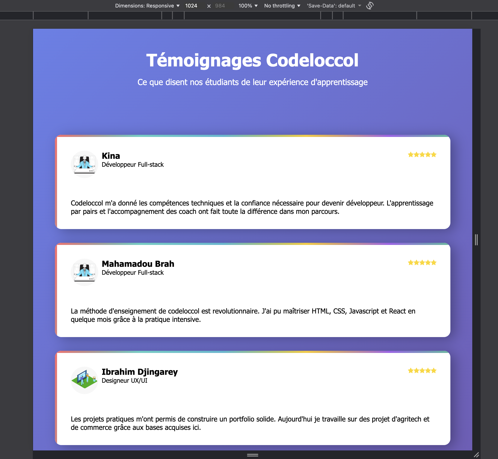
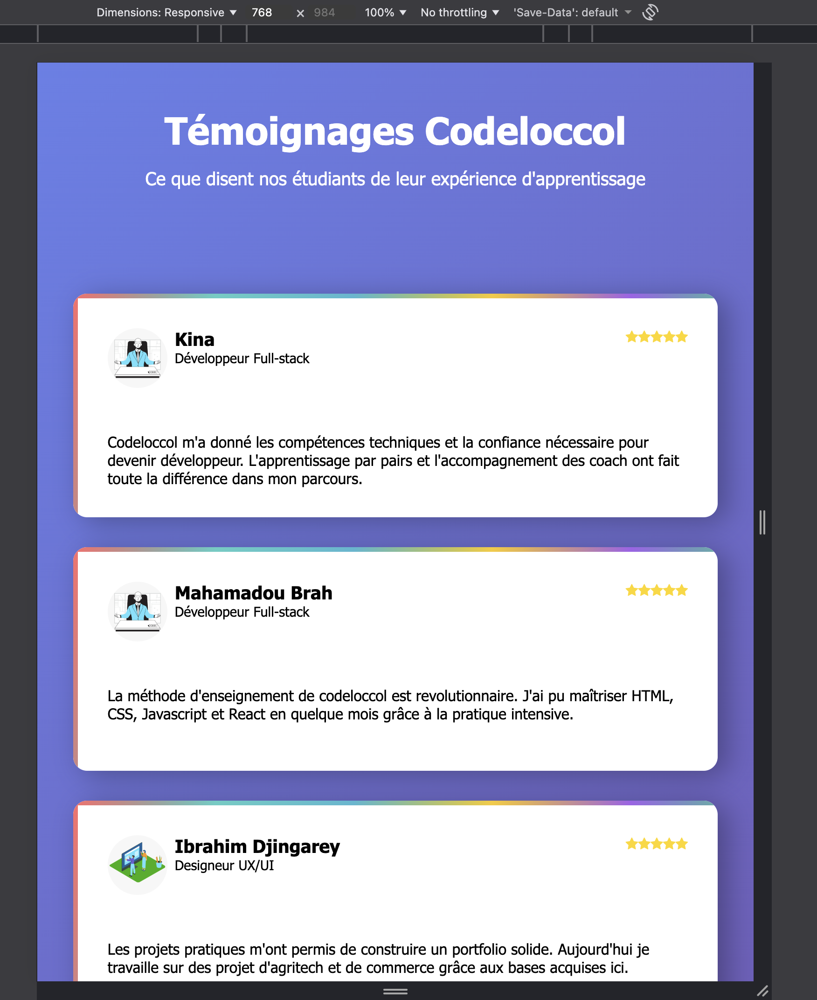
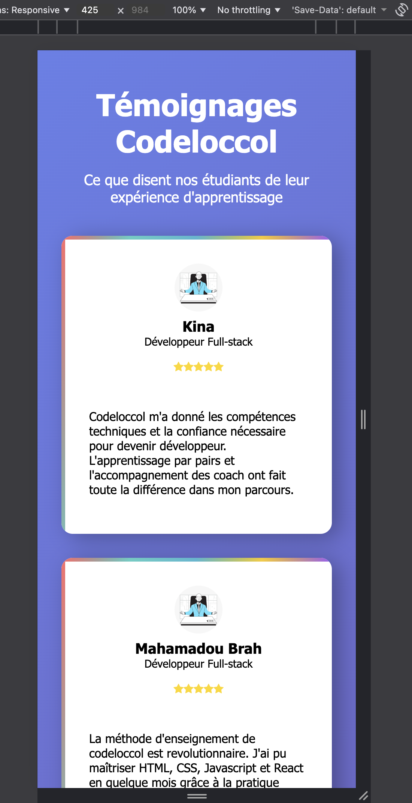
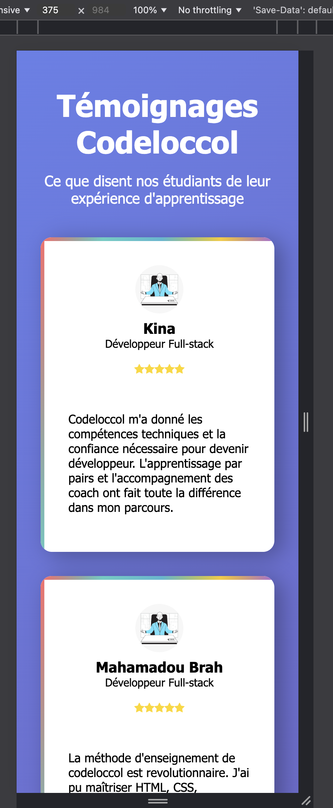
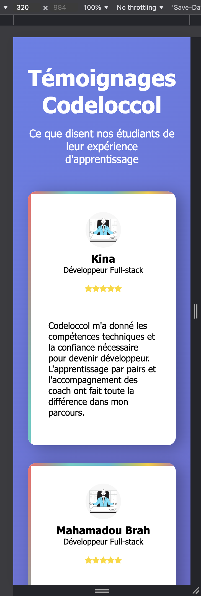

# Testimonial

## Objectif Du Projet

Ce projet consiste à réaliser une page web présentant une grille de témoignages d’étudiants de Codeloccol. L’objectif est de mettre en pratique les compétences en HTML et CSS pour structurer, styliser et rendre responsive une interface utilisateur moderne.

Structurer le contenu avec des balises sémantiques.
Styliser la page pour un rendu professionnel et attractif.
Adapter la grille pour une lecture optimale sur tous les écrans.
Valoriser les retours d’expérience des apprenants.


## Spécifications


Structure HTML sémantique & Respect du style guide, Grille responsive & Utilisation de CSS Grid, Effets d’animation & Cohérence visuelle.


## Ma Structure

```
body
└── main
    ├── section.section1
    │   ├── h1 ("Témoignages Codeloccol")
    │   └── p ("Ce que disent nos étudiants...")
    │
    ├── section.sectionCard.section2
    │   └── div.border
    │       ├── header
    │       │   ├── div
    │       │   │   ├── img[src="social_2.jpeg"]
    │       │   │   └── section
    │       │   │       ├── h3 ("Kina")
    │       │   │       └── p ("Développeur Full-stack")
    │       │   └── p (icônes étoiles)
    │       └── p (témoignage texte)
    │
    ├── section.sectionCard.section3
    │   └── div.border
    │       ├── header
    │       │   ├── div
    │       │   │   ├── img[src="social_2.jpeg"]
    │       │   │   └── section
    │       │   │       ├── h3 ("Mahamadou Brah")
    │       │   │       └── p ("Développeur Full-stack")
    │       │   └── p (icônes étoiles)
    │       └── p (témoignage texte)
    │
    ├── section.sectionCard.section4
    │   └── div.border
    │       ├── header
    │       │   ├── div
    │       │   │   ├── img[src="social_3.jpeg"]
    │       │   │   └── section
    │       │   │       ├── h3 ("Ibrahim Djingarey")
    │       │   │       └── p ("Designeur UX/UI")
    │       │   └── p (icônes étoiles)
    │       └── p (témoignage texte)
    │
    ├── section.sectionCard.section5
    │   └── div.border
    │       ├── header
    │       │   ├── div
    │       │   │   ├── img[src="social_1-1.jpeg"]
    │       │   │   └── section
    │       │   │       ├── h3 ("Yacoubou")
    │       │   │       └── p#star ("Développeur Front-end et mobile")
    │       │   └── p (icônes étoiles)
    │       └── p (témoignage texte)
    │
    ├── section.sectionCard.section6
    │   └── div.border
    │       ├── header
    │       │   ├── div
    │       │   │   ├── img[src="social_1-1.jpeg"]
    │       │   │   └── section
    │       │   │       ├── h3 ("Mariam")
    │       │   │       └── p ("Chef de projet tech")
    │       │   └── p (icônes étoiles)
    │       └── p (témoignage texte)
    │
    ├── section.sectionCard.section7
    │   └── div.border
    │       ├── header
    │       │   ├── div
    │       │   │   ├── img[src="social_3.jpeg"]
    │       │   │   └── section
    │       │   │       ├── h3 ("Haoua")
    │       │   │       └── p ("Entrepreneur tech")
    │       │   └── p (icônes étoiles)
    │       └── p (témoignage texte)
    │
    └── section.sectionCard.section8
        └── div.border
            └── header
                ├── div
                │   ├── img[src="social_3.jpeg"]
                │   └── section
                │       ├── h3 ("Yacouba")
                │       └── p ("Entrepreneur tech")
                └── p (icônes étoiles)
```


## Propriétés CSS

1. Reset global

*{ margin: 0; padding: 0; font-family: ...; }
→ Supprime les marges/paddings par défaut et applique une police uniforme.

2. Variables CSS (:root)

Couleurs, ombres et dégradés sont définis pour réutilisation facile.

Exemples :

--Background-Gradient → fond dégradé violet/bleu.

--Stars → couleur des étoiles (jaune).

--Testimonial-Card-Shadow → ombre des cartes témoignages.

3. Body

Centré horizontalement et verticalement (flex).

Padding large pour espace autour.

Fond dégradé avec la variable --Background-Gradient.

4. Main

Utilise grid pour aligner les sections en colonnes et lignes.

gap et row-gap ajoutent de l’espace entre les cartes.

Responsif avec différents grid-template-columns pour tablette et mobile.

5. Titres

h1 → gros titre (2.5rem).

h3 → sous-titre (1.2rem).

6. Étoiles (i)

Couleur jaune et taille 1.2rem.

7. Cartes témoignages (.border, .sectionCard)

Bordure décorative avec un dégradé (border-image).

Ombre (box-shadow) pour effet profondeur.

padding interne pour l’espace.

Arrondi des coins (border-radius: 15px) et overflow: hidden.

hover → carte remonte légèrement et l’ombre s’intensifie (transform: translateY(-15px)).

8. Images

Taille fixée à 4rem x 4rem.

Rondes avec border-radius: 50px.

9. Section1 (titre général)

Centré avec text-align: center.

Couleur blanche (--Header-Text).

Gap entre titre et texte.

10. Header des cartes

Flex pour aligner photo et infos utilisateur horizontalement.

Gap entre image et texte.

11. Responsivité

Plusieurs @media pour adapter :

Padding du body.

Nombre de colonnes de la grille.

Layout header et cartes pour petits écrans.

Grid-template-rows adaptées pour mobile.

12. Animation simple

sectionCard:hover utilise transform et animation pour effet d’élévation et d’apparition fluide.


## Captures

### Ecran 1440px



### Ecran 1024px



### Ecran 768px



### Ecran 425px



### Ecran 375px



### Ecran 320px



## GitHub Page